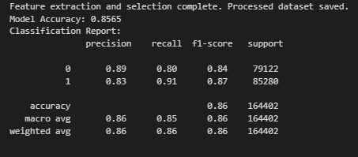

# 🔍 Phishing URL Detection

This repository contains a **phishing detection classifier** that classifies URLs as **phishing or legitimate** using a **Random Forest model**. The model is trained on extracted URL features and can predict malicious URLs based on their structure.

## 📌 Features
- **Feature Extraction**: Extracts URL-based features such as length, number of digits, special characters, subdomains, and presence of an IP address.
- **Machine Learning Model**: Uses a **Random Forest Classifier** for phishing detection.
- **Pre-Trained Model**: The trained model file (`phishing_model.pkl`) is stored on **Google Drive** due to its large size.
- **Testing Module**: Allows users to input URLs and receive phishing classification results.

## 📂 Files in This Repo
- **`rf-model-url-classification.ipynb`** - Training script for the phishing detection model.
- **`test_model.ipynb`** - Loads the saved model and predicts phishing URLs.
- **`feature_selector.pkl`** - Feature selection model used for transformation.
- **`feature_columns.pkl`** - List of selected features.
- **`new_data_urls.zip`** -  dataset containing URLs for testin.

### 📥 Pre-Trained Model
The trained Random Forest model is too large to be stored in this repository. You can download it from Google Drive:

🔗 **[Download phishing_model.pkl](https://drive.google.com/file/d/1oLXjgJ3guGKIpXD465S2de2lXVpG9V01/view?usp=sharing)**

## 📊 Model Performance
The Random Forest model achieved an **accuracy of 85.65%** on the test dataset. Here are the key evaluation metrics:

